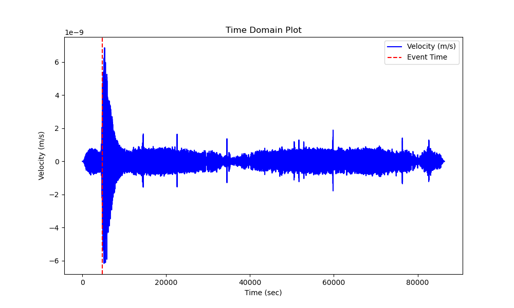

## Sesmistic detection 

### Overview
This project addresses the task of onset detection for seismic data from the Moon and Mars. It is based on detecting the sharpest change in energy, which corresponds to the beginning of the seismic signal.

### Data
The data consists of seismic records that include the event's file name, absolute start time, relative time from the start of the recording, event ID, and type of seismic event. It also contains arrays of time stamps and velocity measurements. These data are used to analyze seismic activity and detect the onset of seismic signals.

# Seismic Signal Detection Method

Our method is based on Spectral Flux.

Spectral flux is a measure of how quickly the power spectrum of a signal changes, calculated by comparing the power spectrum of one frame with the power spectrum of the previous frame.
Our method can be divided into these steps:

### 1. Signal Filtering
For each event in the data (which contains seismic measurements), the signal first passes through a **lowpass filter** to remove unwanted frequencies. The frequency range used for filtering depends on the type of landscape:
- For the **Moon**, a specific frequency range is applied.
- For **Mars**, a different frequency range is used.

### 2. Spectral Flux Calculation
After filtering, the **spectral flux** is computed. This involves comparing the signal’s spectra at different points in time and measuring how much the energy changes in various frequencies. A significant increase in flux may indicate the onset of an event.

### 3. Peak Detection
Once the spectral flux has been calculated, the program searches for **peaks** in the spectral flux graph. These peaks correspond to potential **onsets**—the moments when the signal changes significantly and could mark the beginning of an event.

### 4. Onset Time Determination
If at least one peak is found, the first peak is considered the **onset time** (the start of the event). This time is stored as:
- **Relative time** (in seconds from the start of the recording).
- **Absolute time** (in real-world time).

### 5. Results Saving
For each event, the following results are saved:
- Onset time (relative and absolute).
- Event identifier.
- Signal duration.
- Other relevant details.

The results are stored in a CSV file for each event.

*Seismic ground truth example*


*Detected by algorithm seismic activity*



## Metrics

1. **Median Time Deviation**:

   This is the median of the deviation between the time when the signal was detected by the algorithm and the ground truth annotated in the training dataset.

2. **Median Send Signal Percentage (Predicted)**:

   This is the median percentage of the signal duration where seismic activity was detected by the algorithm, relative to the total signal duration.

3. **Median Send Signal Percentage (Truth)**:

   This is the median percentage of the signal duration where seismic activity was annotated in the dataset, relative to the total signal duration.

4. **Median Percentage Difference**:
   This is the median difference between the "Median send signal percentage (Truth)" and "Median send signal percentage (Predicted)," indicating how the average transmitted signal length in the ground truth differs from the predicted one.

5. **Median signal reduction**:
   This is the median value of how much the length of the transmitted signal has been reduced compared to the total signal length

### Lunar Metrics:
- Median Time Deviation: 352.68 sec
- Median send signal percentage (Predicted): 54.56%
- Median send signal percentage (Truth): 49.65%
- Median percentage difference: -4.90%
- Median signal reduction: 45.44187192204285 %

### Martian Metrics:
- Median Time Deviation: 104.63 sec
- Median send signal percentage (Predicted): 60.47%
- Median send signal percentage (Truth): 63.37%
- Median percentage difference: 2.91%
- Median signal reduction: 39.531799052764626 %

## Usage
### Requirements
- Python 3.10

### Getting Started
Clone repository
```bash
git clone https://github.com/loipoi3/nasa_hackaton.git
```
Move to project folder
```bash
cd nasa_hackaton
```
## Create conda env 
```bash
conda create --name=nasa python=3.10
```
## Activate virtual environment
```bash
conda activate nasa 
```
## Install dependencies 
```bash
conda install numpy pandas pytables scipy
```

## Run program
```bash
python inference.py --input_file <input_file> --output_folder <output_folder> --landscape <landscape> --mode <mode>
```

# Contacts:
The code was written by the IPTech team. If you have any questions, please contact the team captain via email: namchuk.maksym@gmail.com.
